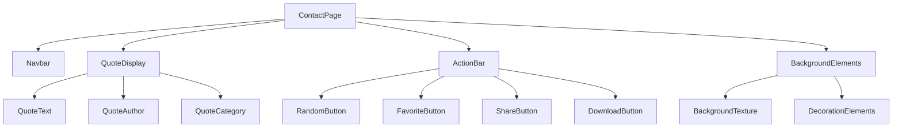
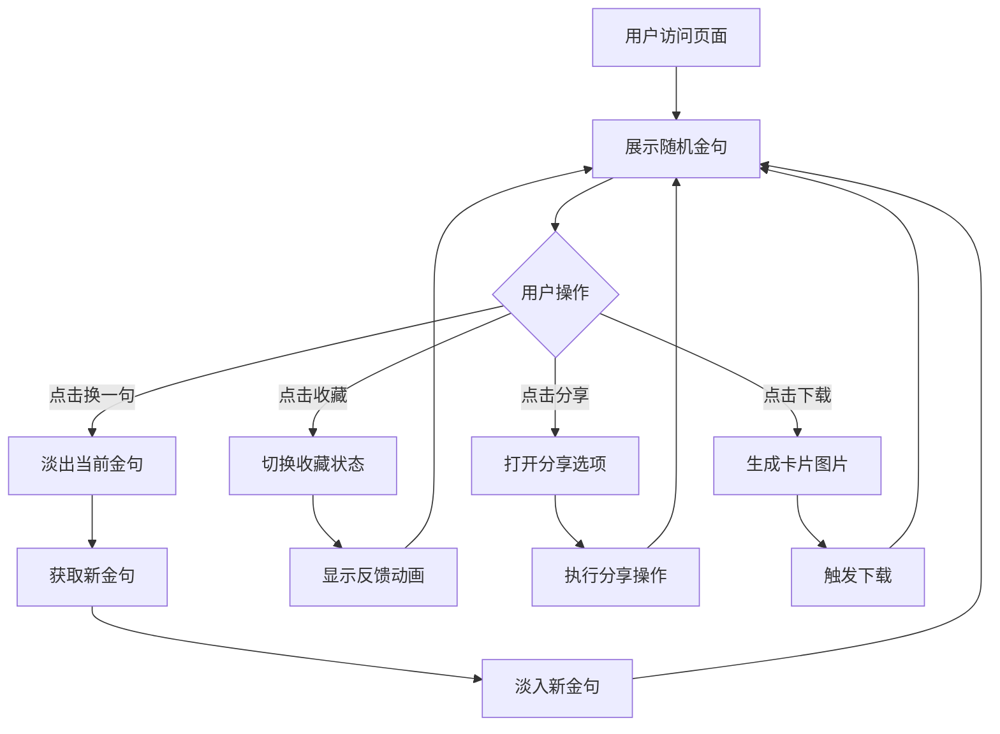

# "一点想法"页面重新设计

## 概述

将现有的博客式"一点想法"页面重新设计为极简主义的教育金句展示页面，采用类似凯文·凯利《宝贵的人生建议》的风格。设计理念是"视觉设计服务于内容"，通过简洁优雅的界面让用户专注于文字的力量。

## 技术栈

- **前端框架**: React 19.1.1
- **构建工具**: Vite 7.1.0
- **样式方案**: CSS Modules + 全局CSS变量
- **字体**: 思源宋体/霞鹜文楷（中文）+ Georgia/Times New Roman（英文）
- **图标**: 自定义引号图标
- **动画**: CSS Transitions + 微妙动画效果

## 页面架构

### 组件结构



### 数据结构

```javascript
const Quote = {
  id: string,
  text: string,
  author: string,
  category: 'education' | 'wisdom' | 'inspiration' | 'learning',
  tags: string[],
  source?: string,
  createdAt: Date
}
```

## 设计规范

### 布局设计

- **页面布局**: 单列居中布局，最大宽度800px
- **内容区域**: 占视口高度的60-70%，垂直居中
- **留白策略**: 
  - 上下边距: 120px以上
  - 左右内边距: 80px（桌面）/ 40px（移动端）
  - 金句与操作按钮间距: 60px
- **响应式断点**: 768px（移动端）/ 1024px（桌面端）

### 字体系统

```css
/* 中文字体栈 */
--font-chinese: "Source Han Serif SC", "LXGW WenKai", "Noto Serif CJK SC", serif;

/* 英文字体栈 */
--font-english: "Georgia", "Times New Roman", "Times", serif;

/* 字体大小 */
--quote-size-desktop: 2.5rem;
--quote-size-mobile: 1.8rem;
--author-size: 1.1rem;
--button-size: 0.95rem;

/* 行高 */
--quote-line-height: 1.8;
--author-line-height: 1.6;
```

### 配色方案

```css
/* 主色调 */
--bg-primary: #fefefe;          /* 主背景 - 纯白稍带暖调 */
--bg-secondary: #f8f9fa;        /* 次要背景 - 浅灰 */
--text-primary: #2d3748;        /* 主文字 - 深灰 */
--text-secondary: #718096;      /* 次要文字 - 中灰 */
--text-muted: #a0aec0;          /* 辅助文字 - 浅灰 */

/* 强调色 */
--accent-primary: #2c5aa0;      /* 深蓝 - 用于按钮和装饰 */
--accent-secondary: #2d5016;    /* 墨绿 - 用于分类标签 */
--accent-light: #e2e8f0;        /* 浅色强调 - 用于背景装饰 */

/* 状态色 */
--success: #38a169;
--warning: #d69e2e;
--error: #e53e3e;
```

### 视觉元素

#### 引号设计
- **样式**: 经典serif引号，大号显示
- **位置**: 金句开头和结尾
- **颜色**: 强调色，透明度60%
- **大小**: 3-4倍于正文字体

#### 背景纹理
- **纸张纹理**: 非常淡的噪声纹理，透明度3-5%
- **几何图案**: 可选的点阵或线条图案
- **约束**: 不影响文字阅读为前提

## 交互功能

### 核心功能

#### 随机展示系统
```javascript
const QuoteManager = {
  quotes: Quote[],
  currentIndex: number,
  usedQuotes: Set<string>,
  
  getRandomQuote(): Quote {
    // 避免重复的智能随机选择
    // 当所有金句都展示过后重置
  },
  
  preloadNext(): Quote {
    // 预加载下一条金句
  }
}
```

#### 收藏功能
- **本地存储**: 使用localStorage保存收藏列表
- **视觉反馈**: 心形图标状态切换
- **收藏列表**: 独立页面或侧边栏展示

#### 分享功能
- **复制文本**: 一键复制金句文本
- **生成链接**: 创建特定金句的分享链接
- **社交分享**: 预设分享文案

#### 下载功能
- **卡片尺寸**: 9:16竖屏比例
- **设计模板**: 
  - 金句居中显示
  - 作者和来源信息
  - 网站品牌标识
  - 优雅的装饰边框

### 动画效果

#### 金句切换动画
```css
.quote-transition {
  transition: all 0.6s cubic-bezier(0.4, 0, 0.2, 1);
}

.quote-enter {
  opacity: 0;
  transform: translateY(20px);
}

.quote-enter-active {
  opacity: 1;
  transform: translateY(0);
}

.quote-exit {
  opacity: 1;
  transform: translateY(0);
}

.quote-exit-active {
  opacity: 0;
  transform: translateY(-20px);
}
```

#### 按钮交互动画
- **悬停效果**: 轻微缩放和颜色渐变
- **点击反馈**: 轻微下沉效果
- **加载状态**: 旋转动画或脉冲效果

## 数据管理

### 金句数据库

```javascript
const educationQuotes = [
  {
    id: "001",
    text: "教育的本质不是传授知识，而是点燃火焰。",
    author: "威廉·巴特勒·叶芝",
    category: "education",
    tags: ["inspiration", "teaching", "knowledge"],
    source: "教育哲学"
  },
  {
    id: "002", 
    text: "学而时习之，不亦说乎？",
    author: "孔子",
    category: "learning",
    tags: ["practice", "joy", "classical"],
    source: "论语"
  },
  // ... 更多金句
]
```

### 分类系统
- **教育哲学** (education): 关于教育本质和理念的思考
- **学习智慧** (learning): 关于学习方法和态度的见解
- **人生启示** (wisdom): 人生哲理和智慧箴言
- **教学艺术** (teaching): 教学方法和师者品格

## 页面结构

### HTML结构
```html
<div class="contact-page">
  <!-- 保留原有导航栏 -->
  <nav class="navbar">...</nav>
  
  <!-- 主内容区 -->
  <main class="quote-container">
    <div class="quote-display">
      <div class="quote-decorations">
        <span class="quote-mark opening">"</span>
        <span class="quote-mark closing">"</span>
      </div>
      
      <blockquote class="quote-text">
        <!-- 金句内容 -->
      </blockquote>
      
      <footer class="quote-footer">
        <cite class="quote-author"><!-- 作者 --></cite>
        <span class="quote-category"><!-- 分类 --></span>
      </footer>
    </div>
    
    <div class="action-bar">
      <button class="btn btn-random">换一句</button>
      <button class="btn btn-favorite">收藏</button>
      <button class="btn btn-share">分享</button>
      <button class="btn btn-download">下载</button>
    </div>
  </main>
  
  <!-- 背景装饰 -->
  <div class="background-elements">
    <div class="texture-overlay"></div>
  </div>
</div>
```

### CSS组织
```css
/* 1. CSS变量定义 */
:root { ... }

/* 2. 全局重置和基础样式 */
* { ... }
body { ... }

/* 3. 布局容器 */
.contact-page { ... }
.quote-container { ... }

/* 4. 金句展示组件 */
.quote-display { ... }
.quote-text { ... }
.quote-footer { ... }

/* 5. 交互按钮 */
.action-bar { ... }
.btn { ... }

/* 6. 装饰元素 */
.quote-decorations { ... }
.background-elements { ... }

/* 7. 动画定义 */
@keyframes fadeInUp { ... }
@keyframes buttonPress { ... }

/* 8. 响应式适配 */
@media (max-width: 768px) { ... }
```

## 用户体验设计

### 交互流程



### 性能优化

#### 预加载策略
- **金句预加载**: 后台预载下3-5条金句
- **图片懒加载**: 按需加载背景纹理
- **字体优化**: 使用font-display: swap

#### 缓存策略
- **金句数据**: localStorage缓存已访问的金句
- **用户偏好**: 记住用户的分类偏好
- **收藏数据**: 本地持久化存储

### 可访问性设计

#### 语义化HTML
- **proper heading hierarchy**: h1 > h2 > h3
- **landmark roles**: main, nav, article
- **ARIA labels**: 为交互按钮添加描述

#### 键盘导航
- **Tab order**: 逻辑的焦点顺序
- **快捷键**: 空格键换金句，Enter键执行操作
- **焦点指示**: 清晰的焦点样式

#### 颜色对比
- **WCAG AA标准**: 文字对比度至少4.5:1
- **色盲友好**: 不仅依赖颜色传达信息
- **高对比模式**: 支持系统高对比设置

## 技术实现要点

### 状态管理
```javascript
const useQuoteManager = () => {
  const [currentQuote, setCurrentQuote] = useState(null);
  const [favorites, setFavorites] = useState([]);
  const [isLoading, setIsLoading] = useState(false);
  const [animationState, setAnimationState] = useState('idle');
  
  const nextQuote = useCallback(async () => {
    setAnimationState('exiting');
    await delay(300); // 等待退出动画
    const newQuote = QuoteManager.getRandomQuote();
    setCurrentQuote(newQuote);
    setAnimationState('entering');
  }, []);
  
  return { currentQuote, favorites, nextQuote, toggleFavorite };
};
```

### 图片生成功能
```javascript
const generateQuoteCard = async (quote) => {
  const canvas = document.createElement('canvas');
  const ctx = canvas.getContext('2d');
  
  // 设置画布尺寸 (9:16)
  canvas.width = 1080;
  canvas.height = 1920;
  
  // 绘制背景
  ctx.fillStyle = '#fefefe';
  ctx.fillRect(0, 0, canvas.width, canvas.height);
  
  // 绘制金句文本
  ctx.font = '72px Source Han Serif SC';
  ctx.fillStyle = '#2d3748';
  ctx.textAlign = 'center';
  
  // 文本换行处理
  const lines = wrapText(ctx, quote.text, canvas.width - 160);
  lines.forEach((line, index) => {
    ctx.fillText(line, canvas.width / 2, 600 + index * 120);
  });
  
  // 绘制作者信息
  ctx.font = '42px Source Han Serif SC';
  ctx.fillStyle = '#718096';
  ctx.fillText(`— ${quote.author}`, canvas.width / 2, 1400);
  
  return canvas.toDataURL('image/png');
};
```

### 响应式实现
```css
.quote-text {
  font-size: clamp(1.5rem, 4vw, 2.5rem);
  line-height: 1.8;
  max-width: 100%;
  padding: 0 2rem;
}

@media (max-width: 768px) {
  .quote-container {
    padding: 2rem 1rem;
    min-height: calc(100vh - 120px);
  }
  
  .action-bar {
    flex-direction: column;
    gap: 1rem;
  }
  
  .btn {
    width: 100%;
    padding: 1rem;
  }
}
```

## 测试策略

### 功能测试
- **金句展示**: 验证随机选择逻辑
- **收藏功能**: 测试本地存储操作
- **分享功能**: 测试各种分享场景
- **下载功能**: 验证图片生成质量

### 兼容性测试
- **浏览器支持**: Chrome, Firefox, Safari, Edge
- **移动端测试**: iOS Safari, Android Chrome
- **字体降级**: 测试字体加载失败情况

### 性能测试
- **加载速度**: 首屏渲染时间 < 2s
- **动画性能**: 保持60fps流畅度
- **内存使用**: 长时间使用内存稳定

### 用户体验测试
- **易用性测试**: 用户操作路径是否清晰
- **可访问性测试**: 屏幕阅读器兼容性
- **视觉测试**: 不同设备屏幕显示效果