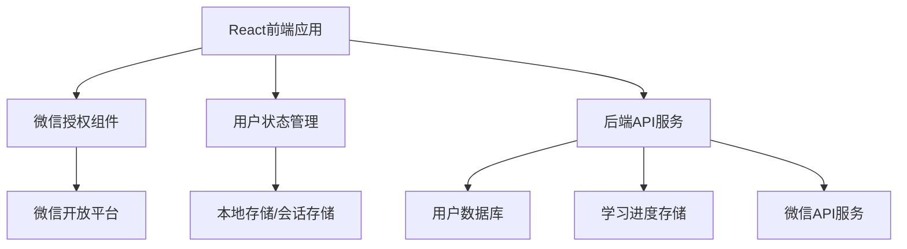

# 微信登录功能 - 需求对齐文档

## 1. 项目上下文分析

### 1.1 现有项目特性
- **项目名称**: 上节好课 - AI数学冒险故事游戏
- **技术栈**: React 19.1.1 + Vite 7.1.1
- **项目类型**: 教育游戏平台，面向小学三年级学生
- **核心功能**: AI驱动的数学冒险故事游戏
- **部署方式**: 静态网站托管（支持Vercel等平台）
- **现有架构**: 前端单页应用，通过代理服务器调用AI API

### 1.2 现有代码模式分析
- **组件结构**: 基于React函数组件和Hooks
- **状态管理**: 使用useState和useEffect进行本地状态管理
- **样式方案**: CSS3 + 模块化样式文件
- **API调用**: 通过fetch进行异步请求
- **错误处理**: 基础的try-catch和状态反馈

### 1.3 业务域理解
- **目标用户**: 小学三年级学生及其家长/老师
- **使用场景**: 家庭学习、课堂辅助、课后练习
- **核心价值**: 通过游戏化方式提升数学学习兴趣和效果
- **用户流程**: 选择知识点 → 选择冒险场景 → 进行游戏化学习

## 2. 原始需求分析

### 2.1 用户需求描述
"我想要增加一个登陆功能，用户可以用微信登陆"

### 2.2 需求背景推测
- **用户身份管理**: 需要识别和记录用户学习进度
- **个性化体验**: 为不同用户提供定制化内容
- **数据持久化**: 保存用户的游戏进度和学习记录
- **社交化学习**: 可能需要分享学习成果到微信

## 3. 边界确认

### 3.1 功能范围
**包含功能**:
- 微信授权登录流程
- 用户基本信息获取（昵称、头像）
- 登录状态管理和持久化
- 用户学习数据关联
- 登出功能

**不包含功能**:
- 其他第三方登录方式（QQ、支付宝等）
- 传统用户名密码注册登录
- 复杂的用户权限管理系统
- 微信支付功能
- 企业微信登录

### 3.2 技术边界
- **前端实现**: 基于现有React架构
- **后端需求**: 需要服务端支持微信OAuth流程
- **数据存储**: 需要用户数据和学习进度存储方案
- **安全要求**: 符合微信开放平台安全规范

## 4. 需求理解

### 4.1 对现有项目的理解
- **当前状态**: 项目为纯前端应用，无用户系统
- **数据存储**: 当前使用localStorage进行临时数据存储
- **API架构**: 通过代理服务器调用AI服务，无用户认证
- **部署模式**: 静态网站部署，需要考虑服务端集成方案

### 4.2 集成影响分析
- **架构变更**: 需要引入用户状态管理
- **数据流变更**: 学习数据需要与用户ID关联
- **UI变更**: 需要添加登录入口和用户信息展示
- **存储变更**: 从本地存储迁移到云端存储

## 5. 疑问澄清

### 5.1 技术实现疑问

**Q1: 微信登录类型选择**
- 网页授权登录（适用于微信内置浏览器）
- 微信开放平台网站应用登录（适用于PC端浏览器）
- 需要确认主要使用场景和目标平台

**Q2: 后端服务架构**
- 是否需要独立的后端服务？
- 可以使用现有的代理服务器扩展功能？
- 考虑使用Serverless方案（如Vercel Functions）？

**Q3: 数据存储方案**
- 用户数据存储在哪里？（数据库类型和位置）
- 学习进度数据结构设计
- 数据备份和迁移策略

### 5.2 业务逻辑疑问

**Q4: 用户体验流程**
- 是否支持游客模式（未登录也可以使用）？
- 登录后如何处理之前的游客数据？
- 用户首次登录是否需要引导流程？

**Q5: 数据同步策略**
- 学习进度实时同步还是定期同步？
- 离线数据如何处理？
- 多设备数据同步策略

**Q6: 隐私和安全**
- 需要获取哪些用户信息？
- 儿童隐私保护措施
- 数据使用和存储合规要求

### 5.3 产品功能疑问

**Q7: 社交功能需求**
- 是否需要分享学习成果到微信？
- 是否需要好友系统或排行榜？
- 家长监控功能需求

**Q8: 个性化功能**
- 基于用户数据的个性化推荐
- 学习报告和统计功能
- 成就系统和激励机制

## 6. 技术约束分析

### 6.1 现有技术栈约束
- **React版本**: 19.1.1，需要兼容的状态管理方案
- **构建工具**: Vite 7.1.1，需要考虑环境变量和代理配置
- **部署平台**: 静态托管，需要考虑服务端功能实现

### 6.2 微信平台约束
- **开发者认证**: 需要微信开放平台开发者账号
- **域名要求**: 需要备案域名和HTTPS支持
- **审核流程**: 应用需要通过微信平台审核

### 6.3 安全和合规约束
- **儿童隐私**: 需要符合儿童在线隐私保护法规
- **数据安全**: 用户数据加密存储和传输
- **访问控制**: 防止未授权访问用户数据

## 7. 初步技术方案

### 7.1 推荐架构方案

### 7.2 技术选型建议
- **状态管理**: React Context + useReducer
- **HTTP客户端**: 现有fetch方案扩展
- **后端服务**: Vercel Functions或类似Serverless方案
- **数据库**: Supabase或Firebase（支持实时同步）
- **认证方案**: JWT Token + 微信OpenID

## 8. 下一步行动

### 8.1 需要确认的关键决策
1. **微信登录类型**: 网页授权 vs 开放平台登录
2. **后端架构**: Serverless vs 传统服务器
3. **数据库选择**: 具体的数据存储方案
4. **用户体验**: 游客模式支持策略

### 8.2 前置准备工作
1. 申请微信开放平台开发者账号
2. 准备HTTPS域名和SSL证书
3. 选择和配置数据库服务
4. 设计用户数据模型

---

**文档状态**: 初稿完成，等待关键决策确认  
**创建时间**: 2025年1月  
**负责人**: AI助手  
**下一阶段**: 等待用户确认后进入架构设计阶段