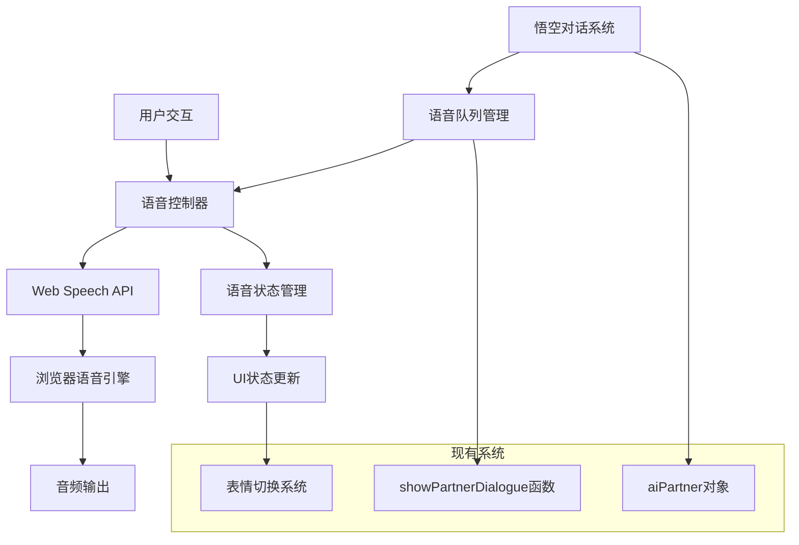
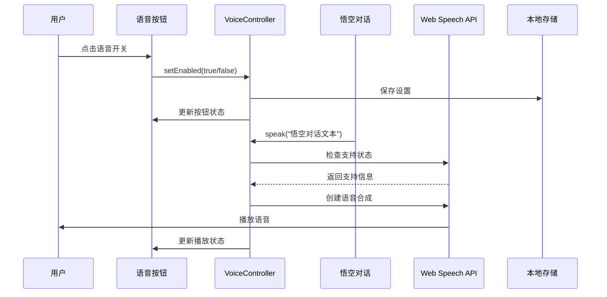

# 悟空语音功能设计文档

## 整体架构设计



## 核心组件设计

### 1. 语音控制器 (VoiceController)

**职责**: 管理语音合成的核心逻辑

**核心方法**:
```javascript
class VoiceController {
    constructor()
    isSupported()           // 检测浏览器支持
    speak(text, options)    // 语音合成
    stop()                  // 停止播放
    setEnabled(enabled)     // 设置开关状态
    getVoices()            // 获取可用语音
}
```

### 2. 语音状态管理 (VoiceState)

**职责**: 管理语音功能的状态和配置

**状态属性**:
```javascript
const voiceState = {
    enabled: true,          // 语音开关状态
    speaking: false,        // 当前播放状态
    supported: false,       // 浏览器支持状态
    voice: null,           // 选中的语音
    rate: 1.0,             // 语速
    pitch: 1.2,            // 音调
    volume: 0.8            // 音量
}
```

### 3. 语音队列管理 (VoiceQueue)

**职责**: 处理多个语音请求的排队和播放

**核心逻辑**:
- 新语音请求时停止当前播放
- 避免语音重叠播放
- 提供播放状态回调

## 分层设计

### 表现层 (UI Layer)
- **语音开关按钮**: 音量图标，点击切换开关状态
- **播放状态指示**: 悟空头像播放动画效果
- **错误提示**: 不支持语音时的友好提示

### 业务层 (Business Layer)
- **语音配置管理**: 语音参数设置和持久化
- **对话集成**: 与现有showPartnerDialogue函数集成
- **状态同步**: 语音状态与UI状态同步

### 数据层 (Data Layer)
- **本地存储**: localStorage保存用户语音偏好
- **语音缓存**: 避免重复初始化语音引擎

## 接口契约定义

### 1. 语音合成接口
```javascript
// 输入契约
interface SpeakOptions {
    text: string;           // 要播放的文本
    voice?: string;         // 语音名称
    rate?: number;          // 语速 (0.1-10)
    pitch?: number;         // 音调 (0-2)
    volume?: number;        // 音量 (0-1)
}

// 输出契约
interface SpeakResult {
    success: boolean;       // 播放是否成功
    error?: string;         // 错误信息
    duration?: number;      // 播放时长
}
```

### 2. 状态管理接口
```javascript
// 状态更新接口
interface VoiceStateUpdate {
    enabled?: boolean;
    speaking?: boolean;
    voice?: SpeechSynthesisVoice;
}

// 状态监听接口
interface VoiceStateListener {
    onEnabledChange(enabled: boolean): void;
    onSpeakingChange(speaking: boolean): void;
    onError(error: string): void;
}
```

## 数据流向图



## 异常处理策略

### 1. 浏览器不支持处理
```javascript
if (!window.speechSynthesis) {
    // 隐藏语音按钮
    // 显示友好提示
    // 正常显示文字对话
}
```

### 2. 语音加载失败处理
```javascript
utterance.onerror = function(event) {
    console.warn('语音播放失败:', event.error);
    // 重置播放状态
    // 显示错误提示
    // 降级到文字显示
};
```

### 3. 网络异常处理
- 语音引擎初始化超时处理
- 语音列表加载失败降级
- 播放中断恢复机制

## 性能优化策略

### 1. 懒加载
- 首次使用时才初始化语音引擎
- 按需加载语音列表

### 2. 缓存策略
- 缓存语音引擎实例
- 缓存用户语音偏好设置

### 3. 资源管理
- 及时清理未使用的语音实例
- 避免内存泄漏

## 集成方案

### 与现有系统集成点

1. **HTML结构扩展**
   - 在AI伙伴容器中添加语音按钮
   - 添加播放状态指示元素

2. **CSS样式扩展**
   - 语音按钮样式定义
   - 播放动画效果
   - 响应式适配

3. **JavaScript功能集成**
   - 扩展aiPartner对象
   - 修改showPartnerDialogue函数
   - 添加语音控制逻辑

### 向后兼容性
- 不影响现有功能
- 语音功能作为增强特性
- 优雅降级处理

## 测试策略

### 1. 功能测试
- 语音播放正确性测试
- 开关控制功能测试
- 状态同步测试

### 2. 兼容性测试
- Chrome/Safari/Firefox浏览器测试
- 移动端浏览器测试
- 不支持语音的浏览器测试

### 3. 性能测试
- 语音播放延迟测试
- 内存使用情况测试
- 并发播放处理测试

## 部署考虑

### 1. 浏览器兼容性
- 现代浏览器支持良好
- IE浏览器需要降级处理
- 移动端Safari需要用户交互触发

### 2. 用户体验
- 首次使用引导
- 语音权限请求处理
- 网络环境适配
