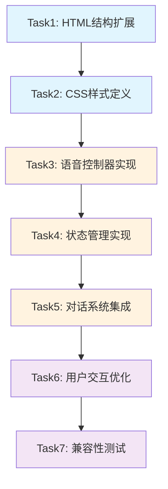

# 悟空语音功能任务拆分文档

## 任务依赖关系图



## 原子任务详细定义

### Task1: HTML结构扩展

**任务描述**: 在现有HTML结构中添加语音控制相关的UI元素

**输入契约**:
- 前置依赖: 现有shuxueyouxi.html文件
- 输入数据: AI伙伴容器的现有结构
- 环境依赖: 无

**输出契约**:
- 输出数据: 包含语音按钮和状态指示的HTML结构
- 交付物: 更新后的shuxueyouxi.html文件
- 验收标准: 
  - 语音开关按钮正确添加到AI伙伴容器中
  - 播放状态指示元素正确定位
  - 不影响现有页面布局

**实现约束**:
- 技术栈: HTML5
- 接口规范: 使用语义化标签和合适的class命名
- 质量要求: 代码简洁，注释清晰

**具体实现内容**:
```html
<!-- 在AI伙伴容器中添加 -->
<div class="voice-control">
    <button id="voice-toggle" class="voice-btn" title="语音开关">
        <span class="voice-icon">🔊</span>
    </button>
</div>
<div class="voice-status" id="voice-status">
    <span class="speaking-indicator">🎵</span>
</div>
```

---

### Task2: CSS样式定义

**任务描述**: 为语音控制UI元素定义样式，确保与现有设计风格一致

**输入契约**:
- 前置依赖: Task1完成
- 输入数据: 新增的HTML元素结构
- 环境依赖: 现有CSS样式文件

**输出契约**:
- 输出数据: 语音控制相关的CSS样式
- 交付物: 更新后的shuxueyouxi-style.css文件
- 验收标准:
  - 语音按钮样式与现有按钮风格一致
  - 播放状态指示动画流畅
  - 响应式设计适配移动端
  - 悬停和点击效果良好

**实现约束**:
- 技术栈: CSS3
- 接口规范: 使用现有的CSS变量和类命名规范
- 质量要求: 兼容主流浏览器，动画性能优化

**具体实现内容**:
- 语音按钮基础样式
- 开关状态切换样式
- 播放指示动画效果
- 响应式布局调整

---

### Task3: 语音控制器实现

**任务描述**: 实现核心的语音合成控制逻辑

**输入契约**:
- 前置依赖: Task2完成
- 输入数据: Web Speech API接口
- 环境依赖: 支持Web Speech API的浏览器

**输出契约**:
- 输出数据: VoiceController类和相关方法
- 交付物: 语音控制器代码模块
- 验收标准:
  - 语音合成功能正常工作
  - 浏览器兼容性检测准确
  - 错误处理完善
  - 语音参数配置合理

**实现约束**:
- 技术栈: 原生JavaScript ES6+
- 接口规范: 遵循现有代码风格和命名规范
- 质量要求: 异常处理完善，性能优化

**具体实现内容**:
```javascript
class VoiceController {
    constructor() {
        this.synthesis = window.speechSynthesis;
        this.voices = [];
        this.currentUtterance = null;
        this.isSupported = !!this.synthesis;
    }
    
    // 核心方法实现
    async speak(text, options = {}) {}
    stop() {}
    getVoices() {}
    setVoice(voiceName) {}
}
```

---

### Task4: 状态管理实现

**任务描述**: 实现语音功能的状态管理和持久化

**输入契约**:
- 前置依赖: Task3完成
- 输入数据: VoiceController实例
- 环境依赖: localStorage支持

**输出契约**:
- 输出数据: 状态管理对象和相关方法
- 交付物: 状态管理代码模块
- 验收标准:
  - 语音开关状态正确保存和恢复
  - 状态变化时UI正确更新
  - 状态监听机制工作正常

**实现约束**:
- 技术栈: 原生JavaScript
- 接口规范: 观察者模式实现状态监听
- 质量要求: 状态同步准确，无内存泄漏

**具体实现内容**:
```javascript
const voiceState = {
    enabled: true,
    speaking: false,
    supported: false,
    listeners: [],
    
    // 状态管理方法
    setState(newState) {},
    subscribe(listener) {},
    unsubscribe(listener) {},
    saveToStorage() {},
    loadFromStorage() {}
};
```

---

### Task5: 对话系统集成

**任务描述**: 将语音功能集成到现有的悟空对话系统中

**输入契约**:
- 前置依赖: Task4完成
- 输入数据: 现有的aiPartner对象和showPartnerDialogue函数
- 环境依赖: 现有的对话系统代码

**输出契约**:
- 输出数据: 集成语音功能的对话系统
- 交付物: 更新后的shuxueyouxi-script.js文件
- 验收标准:
  - 悟空对话时自动播放语音
  - 语音播放不影响现有对话逻辑
  - 语音开关控制生效
  - 播放状态正确显示

**实现约束**:
- 技术栈: 原生JavaScript
- 接口规范: 保持现有函数接口不变
- 质量要求: 向后兼容，无破坏性变更

**具体实现内容**:
- 扩展aiPartner对象添加语音功能
- 修改showPartnerDialogue函数集成语音播放
- 添加语音按钮事件监听
- 实现播放状态UI更新

---

### Task6: 用户交互优化

**任务描述**: 优化语音功能的用户体验和交互细节

**输入契约**:
- 前置依赖: Task5完成
- 输入数据: 集成后的完整功能
- 环境依赖: 完整的页面环境

**输出契约**:
- 输出数据: 优化后的用户交互体验
- 交付物: 完善的语音功能实现
- 验收标准:
  - 语音播放流畅无卡顿
  - 用户操作反馈及时
  - 错误提示友好
  - 移动端体验良好

**实现约束**:
- 技术栈: JavaScript + CSS动画
- 接口规范: 遵循用户体验最佳实践
- 质量要求: 交互流畅，反馈及时

**具体实现内容**:
- 语音播放队列管理
- 播放动画效果优化
- 错误提示和降级处理
- 性能优化和资源管理

---

### Task7: 兼容性测试和优化

**任务描述**: 测试语音功能在不同浏览器和设备上的兼容性

**输入契约**:
- 前置依赖: Task6完成
- 输入数据: 完整的语音功能实现
- 环境依赖: 多种浏览器和设备环境

**输出契约**:
- 输出数据: 兼容性测试报告和优化方案
- 交付物: 最终优化的代码和文档
- 验收标准:
  - 主流浏览器功能正常
  - 不支持语音的浏览器优雅降级
  - 移动端功能完整
  - 性能表现良好

**实现约束**:
- 技术栈: 跨浏览器测试
- 接口规范: Web标准兼容
- 质量要求: 兼容性好，性能稳定

**具体实现内容**:
- Chrome/Safari/Firefox测试
- 移动端浏览器测试
- 性能和内存使用测试
- 兼容性问题修复

## 任务执行顺序

1. **阶段一**: Task1 → Task2 (UI基础搭建)
2. **阶段二**: Task3 → Task4 (核心功能实现)
3. **阶段三**: Task5 → Task6 (系统集成和优化)
4. **阶段四**: Task7 (测试和完善)

## 风险评估

### 高风险项
- Web Speech API浏览器兼容性差异
- 移动端语音权限和交互限制

### 中风险项
- 语音播放延迟和性能问题
- 与现有系统集成的兼容性

### 低风险项
- UI样式和布局调整
- 基础功能实现

## 质量保证

### 代码质量
- 遵循现有项目代码规范
- 添加详细的函数注释
- 异常处理完善

### 测试覆盖
- 功能测试覆盖所有核心场景
- 兼容性测试覆盖主流浏览器
- 性能测试确保用户体验

### 文档完善
- 代码注释详细
- 用户使用说明
- 技术实现文档