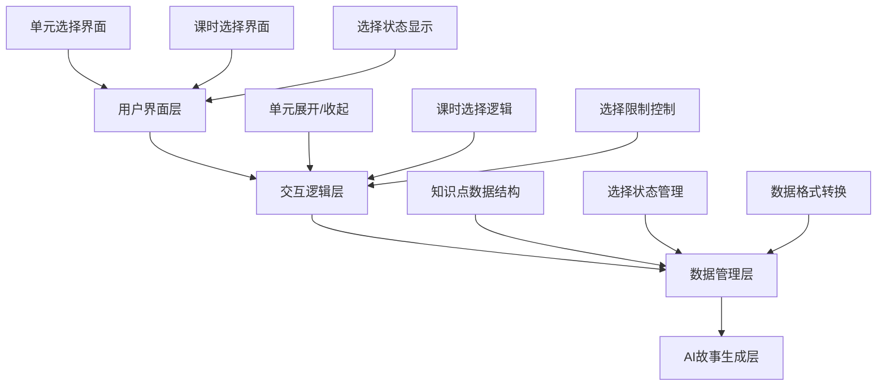
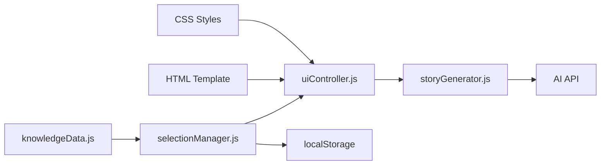
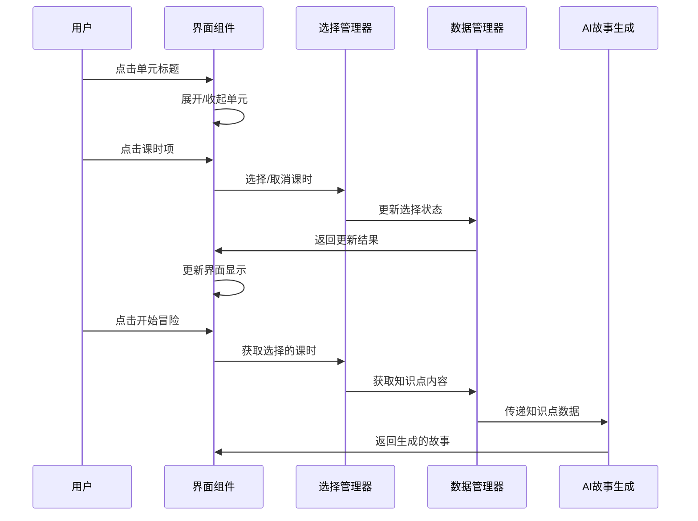

# 数学知识点更新设计文档

## 整体架构设计

### 系统分层


## 核心组件设计

### 1. 数据结构设计

#### 知识点数据结构
```javascript
const knowledgeData = {
  "第一单元": {
    title: "混合运算",
    icon: "🔢",
    lessons: {
      "1.1": {
        name: "小熊购物",
        knowledge: "乘加、乘减混合运算的运算顺序：先算乘法，后算加减法",
        description: "能正确计算乘加、乘减两步式题，结合具体情境理解算式的实际意义"
      },
      "1.2": {
        name: "买文具",
        knowledge: "除加、除减混合运算的运算顺序：先算除法，后算加减法",
        description: "能正确计算除加、除减两步式题，运用混合运算解决生活中的实际问题"
      },
      "1.3": {
        name: "过河",
        knowledge: "带有小括号的两步混合运算的运算顺序：先算小括号里面的，再算小括号外面的",
        description: "理解小括号在混合运算中的作用，解决需要改变运算顺序的实际问题"
      }
    }
  },
  // ... 其他单元
}
```

#### 选择状态数据结构
```javascript
const selectionState = {
  selectedLessons: [
    {
      unit: "第一单元",
      lesson: "1.1",
      name: "小熊购物",
      knowledge: "乘加、乘减混合运算..."
    }
  ],
  expandedUnits: ["第一单元", "第二单元"] // 展开的单元
}
```

### 2. 界面组件设计

#### HTML结构设计
```html
<div class="knowledge-selection">
  <h2>📚 选择知识点（可多选，最多3个）</h2>
  <div class="knowledge-units">
    <!-- 单元容器 -->
    <div class="knowledge-unit" data-unit="第一单元">
      <div class="unit-header">
        <span class="unit-icon">🔢</span>
        <span class="unit-title">第一单元 混合运算</span>
        <span class="expand-icon">▼</span>
      </div>
      <div class="unit-lessons">
        <!-- 课时列表 -->
        <div class="lesson-item" data-unit="第一单元" data-lesson="1.1">
          <span class="lesson-code">1.1</span>
          <span class="lesson-name">小熊购物</span>
          <span class="lesson-desc">乘加、乘减混合运算</span>
        </div>
        <!-- 更多课时... -->
      </div>
    </div>
    <!-- 更多单元... -->
  </div>
</div>
```

#### CSS样式设计要点
```css
/* 单元容器样式 */
.knowledge-unit {
  background: linear-gradient(135deg, #667eea 0%, #764ba2 100%);
  border-radius: 12px;
  margin-bottom: 1rem;
  overflow: hidden;
  transition: all 0.3s ease;
}

/* 单元标题样式 */
.unit-header {
  padding: 1rem;
  cursor: pointer;
  display: flex;
  align-items: center;
  justify-content: space-between;
  color: white;
}

/* 课时列表样式 */
.unit-lessons {
  max-height: 0;
  overflow: hidden;
  transition: max-height 0.3s ease;
  background: rgba(255, 255, 255, 0.1);
}

.unit-lessons.expanded {
  max-height: 500px;
}

/* 课时项样式 */
.lesson-item {
  padding: 0.8rem 1rem;
  border-bottom: 1px solid rgba(255, 255, 255, 0.1);
  cursor: pointer;
  transition: all 0.3s ease;
  display: flex;
  align-items: center;
  gap: 0.5rem;
}

.lesson-item:hover {
  background: rgba(255, 255, 255, 0.2);
}

.lesson-item.selected {
  background: rgba(255, 255, 255, 0.9);
  color: #2c3e50;
}
```

### 3. 交互逻辑设计

#### 单元展开/收起逻辑
```javascript
function toggleUnit(unitElement) {
  const unitLessons = unitElement.querySelector('.unit-lessons');
  const expandIcon = unitElement.querySelector('.expand-icon');
  
  if (unitLessons.classList.contains('expanded')) {
    unitLessons.classList.remove('expanded');
    expandIcon.textContent = '▼';
  } else {
    unitLessons.classList.add('expanded');
    expandIcon.textContent = '▲';
  }
}
```

#### 课时选择逻辑
```javascript
function selectLesson(lessonElement) {
  const unit = lessonElement.dataset.unit;
  const lesson = lessonElement.dataset.lesson;
  const lessonKey = `${unit}-${lesson}`;
  
  if (lessonElement.classList.contains('selected')) {
    // 取消选择
    lessonElement.classList.remove('selected');
    selectedLessons = selectedLessons.filter(l => l.key !== lessonKey);
  } else {
    // 选择课时（最多3个）
    if (selectedLessons.length < 3) {
      lessonElement.classList.add('selected');
      selectedLessons.push({
        key: lessonKey,
        unit: unit,
        lesson: lesson,
        name: getLessonName(unit, lesson),
        knowledge: getLessonKnowledge(unit, lesson)
      });
    }
  }
  
  updateSelectionDisplay();
  updateStartButtonState();
}
```

## 模块依赖关系



## 接口契约定义

### 1. 知识点数据接口
```javascript
// 获取所有单元数据
function getAllUnits() {
  return Object.keys(knowledgeData);
}

// 获取单元的课时列表
function getUnitLessons(unit) {
  return knowledgeData[unit].lessons;
}

// 获取课时的知识点内容
function getLessonKnowledge(unit, lesson) {
  return knowledgeData[unit].lessons[lesson].knowledge;
}
```

### 2. 选择管理接口
```javascript
// 选择课时
function selectLesson(unit, lesson) {
  // 实现选择逻辑
}

// 取消选择
function deselectLesson(unit, lesson) {
  // 实现取消选择逻辑
}

// 获取当前选择
function getSelectedLessons() {
  return selectedLessons;
}

// 清空选择
function clearSelection() {
  selectedLessons = [];
}
```

### 3. UI控制接口
```javascript
// 渲染知识点选择界面
function renderKnowledgeSelection() {
  // 实现界面渲染
}

// 更新选择状态显示
function updateSelectionDisplay() {
  // 实现状态更新
}

// 展开/收起单元
function toggleUnit(unit) {
  // 实现展开收起逻辑
}
```

## 数据流向图



## 异常处理策略

### 1. 数据异常处理
- **缺失数据**: 提供默认值和友好提示
- **格式错误**: 数据验证和格式化
- **加载失败**: 重试机制和错误提示

### 2. 交互异常处理
- **重复选择**: 防止重复添加同一课时
- **超出限制**: 提示用户最多选择3个课时
- **网络错误**: 本地缓存和离线提示

### 3. 兼容性处理
- **旧数据格式**: 提供数据迁移逻辑
- **浏览器兼容**: 使用polyfill和降级方案
- **移动端适配**: 响应式设计和触摸优化

## 性能优化策略

### 1. 渲染优化
- **虚拟滚动**: 大量课时数据的优化显示
- **懒加载**: 按需加载单元内容
- **缓存机制**: 缓存渲染结果

### 2. 交互优化
- **防抖处理**: 避免频繁的状态更新
- **批量更新**: 合并多个DOM操作
- **动画优化**: 使用CSS3硬件加速

### 3. 数据优化
- **数据压缩**: 压缩知识点数据
- **增量更新**: 只更新变化的部分
- **本地存储**: 缓存用户选择状态

## 测试策略

### 1. 单元测试
- 数据管理模块测试
- 选择逻辑测试
- 界面组件测试

### 2. 集成测试
- 完整选择流程测试
- 与故事生成的集成测试
- 跨浏览器兼容性测试

### 3. 用户测试
- 可用性测试
- 性能测试
- 移动端测试

## 部署和维护

### 1. 部署策略
- **渐进式部署**: 分阶段发布新功能
- **回滚机制**: 快速回退到稳定版本
- **监控告警**: 实时监控系统状态

### 2. 维护策略
- **版本管理**: 清晰的版本号和变更日志
- **文档更新**: 及时更新技术文档
- **用户反馈**: 收集和处理用户反馈